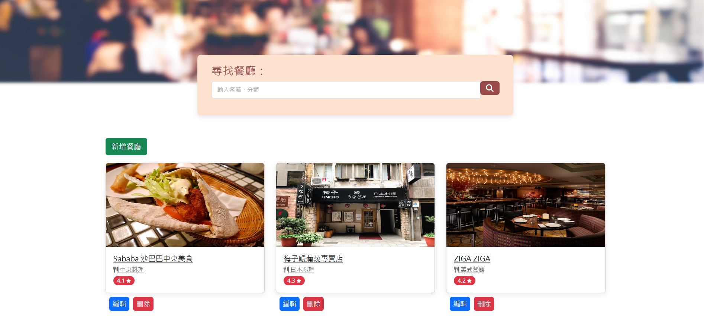

# AC Restaurants

Explore restaurants by name and category, discovering detailed information and ratings on our website. It's built by using [Node.js](https://nodejs.org/en) + [Express](https://www.npmjs.com/package/express), with the template engine [express-handlebars](https://www.npmjs.com/package/express-handlebars) and ORM [Sequelize](https://www.npmjs.com/package/sequelize), which connects to the RDBMS [MySQL](https://www.mysql.com/).

## Preview



## Environment Setup

- This project requires [Node.js](https://nodejs.org/en) to be installed on your system for execution.

- Furthermore, before running the project, you must set up a MySQL database:

1. Install MySQL on your system if it's not already installed. You can download it from [MySQL's official website](https://www.mysql.com/downloads/).

2. Open your MySQL client (such as [MySQL Workbench](https://dev.mysql.com/downloads/workbench/) or command-line client) and create a new database for the project:

   ```sql
   CREATE DATABASE restaurant;
   ```

3. After creating the database, open the config/config.json file in your project directory. Verify and update the development environment configuration to match your database credentials. Here’s an example configuration:

```json
"development": {
    "username": "root",
    "password": "password",
    "database": "restaurant",
    "host": "127.0.0.1",
    "dialect": "mysql"
  }
```

## Features

- Users can click on restaurants to view detailed information.
- Users can add new restaurants to the list and update or delete existing ones.
- Users can search by restaurant name or category.

## Installing

Execute the installation process in the terminal (for Windows users, execute on [Git Bash](https://gitforwindows.org/)):

1. Use the following command to clone this project to your desired local folder: `git clone https://github.com/ZeYuanDuan/Restaurants.git`

2. Change directory to the project folder: `cd Restaurants`

3. Install npm packages: `npm install`

4. Initialize sequelize: `npx sequelize init`

5. Execute the migrations: `npx sequelize-cli db:migrate`

6. Execute the seeder: `npx sequelize db:seed:all`

7. run the server: `npm run dev`

To access the website, enter the URL in your browser: [http://localhost:3000](http://localhost:3000), or click on the link in the console.

## Version Control

This project has the package [commitizen](https://www.npmjs.com/package/commitizen) installed to assist developers in writing commit messages. The usage process is as follows:

1. As with regular git operations, use `git add` to add files to the staging area.
2. You can use the traditional `git commit` to commit files, or use the command:

```
npm run commit
```

3. At this point, an interactive console window will appear. Select the type of changes made (build, feat, etc.) and follow the prompts to fill in the message.

For more information, visit [commitizen](https://www.npmjs.com/package/commitizen).
